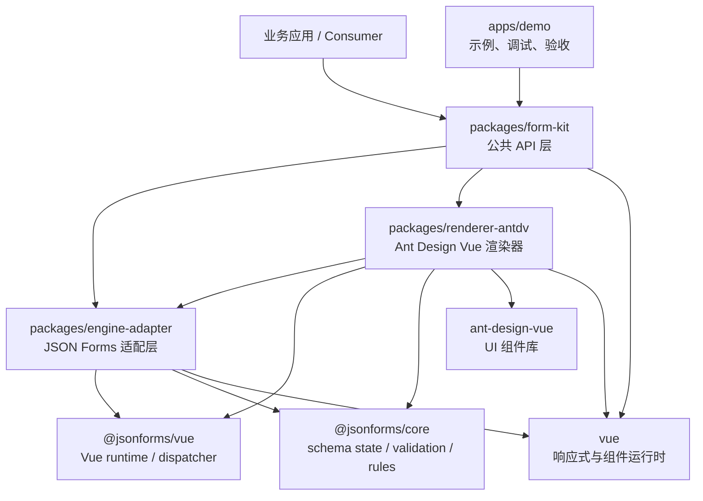
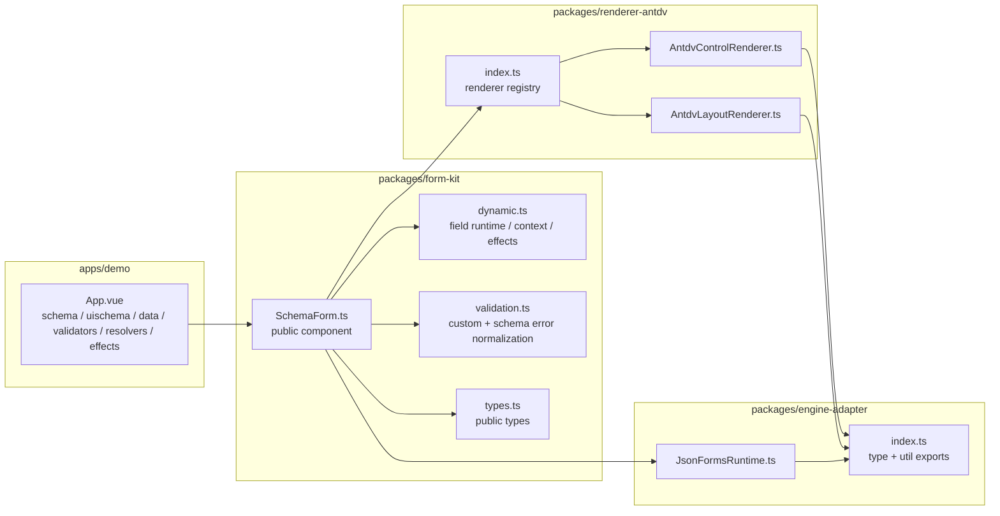
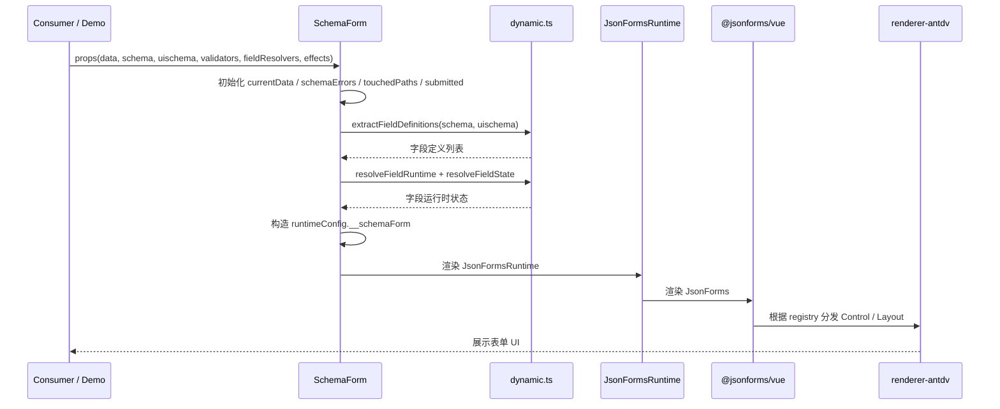
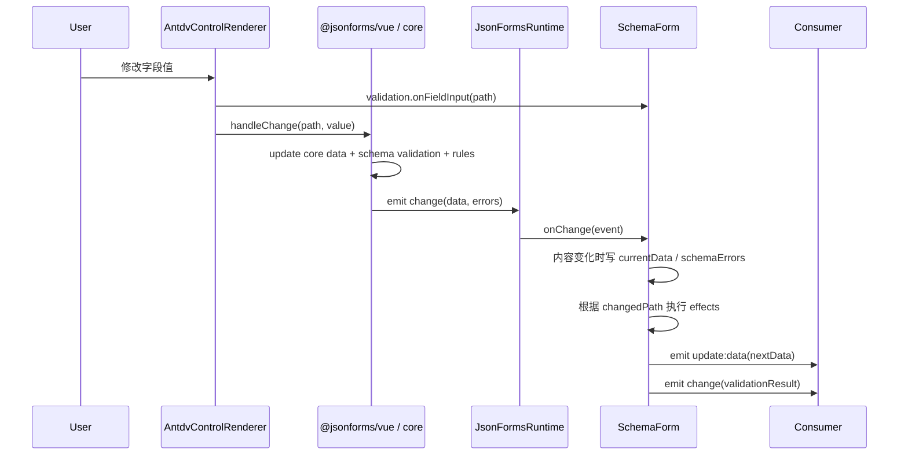
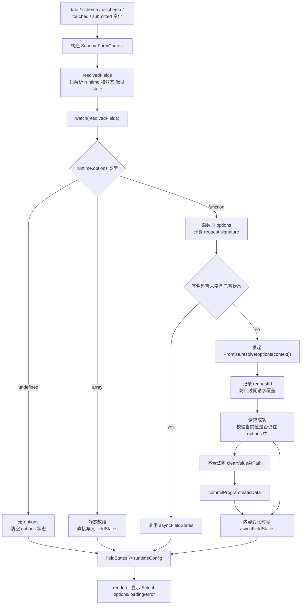
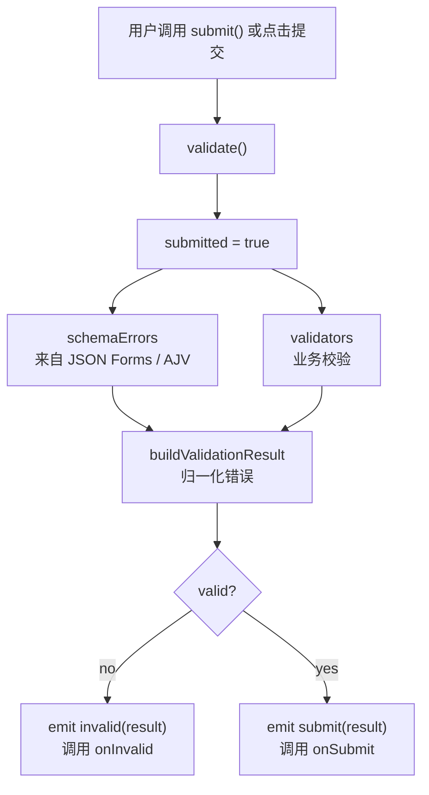
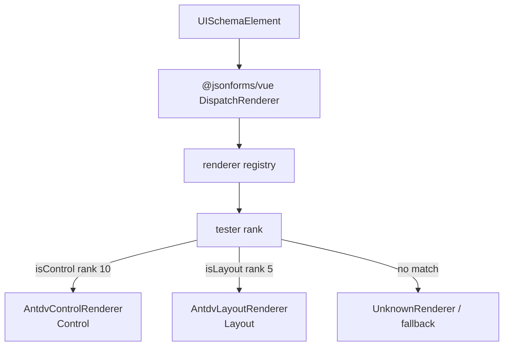

# JSON Form Core 架构文档

日期：2026-04-27

## 1. 文档目的

本文档面向后续维护者和业务接入方，说明 `json-form-core` 当前表单引擎的整体架构、包职责、运行时数据流、扩展点、关键状态模型和已知演进方向。

当前库的核心定位是：以 `JSON Schema + UI Schema` 作为公共表单描述协议，复用 `@jsonforms/core + @jsonforms/vue` 作为底层表单状态与校验引擎，在项目侧提供稳定的 Vue 3 公共封装和 Ant Design Vue 渲染器。

## 2. 架构原则

### 2.1 设计目标

- 对业务侧暴露简单稳定的 `SchemaForm` API。
- 让业务侧主要使用 `@sailornpg/form-kit`，而不是直接依赖 `@jsonforms/vue`。
- 将底层 JSON Forms 的集成细节限制在 `engine-adapter` 和 `form-kit` 内部。
- 将 UI 库绑定限制在 `renderer-antdv`，避免 `ant-design-vue` 泄漏到引擎层。
- 支持标准 JSON Schema 校验、UI Schema 布局、字段运行时状态、业务校验、联动 effects 和异步 options。
- 复杂业务能力通过显式扩展点进入，不在 renderer 中写业务逻辑。

### 2.2 当前非目标

- 不做可视化拖拽表单设计器。
- 不自研完整 JSON Schema 表单核心。
- 不引入自定义表达式 DSL。
- 不在当前阶段支持多 UI 框架并行的一等实现。
- 不把 demo 中的业务示例逻辑上移为框架默认逻辑。

## 3. 总体分层

当前仓库采用 npm workspaces，分为一个 demo 应用和三个库包。



### 3.1 依赖方向约束

| 层级 | 可以依赖 | 不应依赖 |
|---|---|---|
| `apps/demo` | `form-kit` | 不应承载可复用引擎逻辑 |
| `packages/form-kit` | `engine-adapter`、默认 renderer 包、Vue | 业务服务、页面专属逻辑 |
| `packages/renderer-antdv` | `engine-adapter` 类型、JSON Forms renderer API、Ant Design Vue | `form-kit` 组件实现、业务 API |
| `packages/engine-adapter` | `@jsonforms/core`、`@jsonforms/vue`、Vue | Ant Design Vue、业务扩展 API |

核心约束是单向依赖：业务入口向下组装能力，底层适配层不反向知道上层业务语义。

## 4. 包职责

### 4.1 `packages/engine-adapter`

当前核心文件：

- `src/JsonFormsRuntime.ts`
- `src/index.ts`

职责：

- 包装 `@jsonforms/vue` 的 `JsonForms` 组件。
- 统一透传 `data/schema/uischema/renderers/cells/config/additionalErrors/readonly`。
- 把 JSON Forms 的 `change` 事件重新向上抛出。
- 复用并导出 JSON Forms 相关类型和工具函数，例如 `JsonSchema`、`UISchemaElement`、`resolveData`、`resolveSchema`、`toDataPath`。
- 作为上游 JSON Forms API 变化的隔离层。

当前实现特征：

- 适配层很薄，几乎不持有业务状态。
- 不引入 `ant-design-vue`。
- 不直接实现字段联动、业务校验或 async options。

### 4.2 `packages/renderer-antdv`

当前核心文件：

- `src/AntdvControlRenderer.ts`
- `src/AntdvLayoutRenderer.ts`
- `src/index.ts`

职责：

- 提供 JSON Forms renderer registry entries。
- 将 JSON Forms control state 映射为 Ant Design Vue 表单控件。
- 将 JSON Forms layout state 映射为布局容器和子节点分发。
- 从 `config.__schemaForm` 中读取 `form-kit` 注入的运行时字段状态。

当前支持：

| Schema / UI 类型 | 当前渲染 |
|---|---|
| `string` | `Input` 或 `Textarea` |
| `number` / `integer` | `InputNumber` |
| `boolean` | `Switch` |
| `enum` 或 runtime options | `Select` |
| `Group` | `Card` |
| `HorizontalLayout` | CSS grid 多列 |
| 其他 layout | CSS grid 纵向布局 |

重要约束：

- renderer 只负责渲染和调用 `handleChange(path, value)`。
- renderer 不直接请求远程 options。
- renderer 不执行跨字段 effects。
- renderer 不拥有最终校验模型，只显示 JSON Forms 和 `form-kit` 聚合后的状态。

### 4.3 `packages/form-kit`

当前核心文件：

- `src/SchemaForm.ts`
- `src/dynamic.ts`
- `src/validation.ts`
- `src/types.ts`
- `src/index.ts`

职责：

- 提供业务侧主要使用的 `SchemaForm` 组件。
- 注入默认 `antdvRenderers` 和 `antdvCells`。
- 管理受控数据同步、业务校验、字段 touched/submitted 状态。
- 将字段运行时能力转换为 renderer 可消费的内部 config。
- 处理动态字段状态、异步 options、字段 effects。
- 暴露 `validate()`、`submit()`、`resetValidation()` 实例方法。
- 对外派发 `update:data`、`change`、`submit`、`invalid` 事件。

`form-kit` 是当前项目最重要的稳定公共 API 层。

### 4.4 `apps/demo`

职责：

- 演示真实消费方式。
- 验证 schema、uischema、validators、fieldResolvers、effects、async options 的组合行为。
- 提供手动调试入口。

约束：

- demo 可以包含示例业务数据和模拟异步请求。
- demo 不应承载应复用到库里的逻辑。

## 5. 当前模块关系图



## 6. 运行时主流程

### 6.1 表单初始化流程



### 6.2 用户输入流程



### 6.3 动态 options 流程



### 6.4 校验与提交流程



## 7. `SchemaForm` 内部状态模型

`SchemaForm` 当前使用 Vue `shallowRef` 和 `computed` 管理运行时状态。

| 状态 | 类型 | 作用 |
|---|---|---|
| `currentData` | `SchemaFormData` | 当前表单数据快照 |
| `schemaErrors` | `ErrorObject[]` | JSON Forms / AJV 输出的 schema 错误 |
| `touchedPaths` | `string[]` | 用户已经输入过的字段路径 |
| `submitted` | `boolean` | 是否触发过提交或显式校验 |
| `asyncFieldStates` | `DynamicFieldStateMap` | 异步 options 的 loading、options、error |
| `pendingChangedPath` | `string \| undefined` | renderer 最近输入的字段路径，用于 effects |
| `pendingProgrammaticData` | `SchemaFormData \| undefined` | effects 或 options 清理产生的数据，用于识别 JSON Forms echo |
| `hasEmittedRuntimeChange` | `boolean` | 避免相同 runtime change 重复向业务侧派发 |
| `optionRequestIds` | `Map<string, number>` | 异步 options 请求序号，丢弃过期结果 |
| `optionRequestSignatures` | `Map<string, string>` | 异步 options 请求签名，避免重复请求 |

### 7.1 派生状态

| 派生值 | 来源 | 作用 |
|---|---|---|
| `customErrors` | `validators + currentData` | 业务校验错误 |
| `additionalErrors` | `customErrors` | 转为 JSON Forms 可接收的 AJV error 结构 |
| `validationResult` | `schemaErrors + customErrors + currentData` | 对外统一校验结果 |
| `formContext` | 数据、schema、errors、submitted、touched | resolver/effect/options 的上下文 |
| `fieldDefinitions` | `schema + uischema` | 从 UI Schema 提取 Control 字段 |
| `resolvedFields` | `fieldDefinitions + fieldResolvers + runtime` | 字段运行时定义和静态状态 |
| `fieldStates` | `resolvedFields + asyncFieldStates` | renderer 可消费的字段状态 |
| `runtimeConfig` | 表单状态 + fieldStates | 注入到 JSON Forms config |

### 7.2 状态写入原则

当前递归更新修复后，核心状态写入遵循两个原则：

- 内容没变不写 ref。
- computed 中不创建 Promise 或执行异步副作用。

具体受控写入点：

- `setCurrentData(nextData)`
- `setSchemaErrors(nextErrors)`
- `setAsyncFieldStates(nextStates)`
- `commitProgrammaticData(nextData)`

这样可以避免 `JsonForms change -> SchemaForm 写状态 -> runtimeConfig 更新 -> JsonForms 再 change` 的无意义反馈环。

## 8. 运行时 config 协议

`form-kit` 通过 JSON Forms 的 `config` 通道向 renderer 注入项目自有状态。

```ts
type SchemaFormInternalConfig = {
  __schemaForm: {
    validation: {
      displayMode: 'touched' | 'submit' | 'always'
      submitted: boolean
      touchedPaths: string[]
      onFieldInput: (path: string) => void
    }
    fields: Record<string, ResolvedFieldState>
  }
}
```

### 8.1 validation config

renderer 使用该配置决定错误展示时机：

- `always`：始终展示错误。
- `submit`：提交后展示错误。
- `touched`：字段触碰后展示错误，提交后也展示。

`onFieldInput(path)` 由 renderer 在用户输入前调用，用于记录 touched 字段和最近变更字段。

### 8.2 fields config

`fields[path]` 是字段运行时状态：

```ts
type ResolvedFieldState = {
  visible?: boolean
  disabled?: boolean
  required?: boolean
  placeholder?: string
  description?: string
  options?: SchemaFormOption[]
  loading?: boolean
  optionsError?: string
}
```

renderer 读取这些状态后映射到 Ant Design Vue 控件：

- `visible === false` 时不渲染。
- `disabled === true` 时禁用控件。
- `required` 覆盖展示层 required 标记。
- `placeholder/description` 显示提示文案。
- `options/loading/optionsError` 驱动 `Select`。

## 9. 字段动态能力

字段动态能力来自两处：

- UI Schema control options 中的 `runtime` 和 `effects`。
- `SchemaForm` props 中的全局 `fieldResolvers` 和 `effects`。

### 9.1 字段 runtime

```ts
type SchemaFormFieldRuntime = {
  visible?: boolean | ((context: SchemaFormContext) => boolean)
  disabled?: boolean | ((context: SchemaFormContext) => boolean)
  required?: boolean | ((context: SchemaFormContext) => boolean)
  placeholder?: string | ((context: SchemaFormContext) => string | undefined)
  description?: string | ((context: SchemaFormContext) => string | undefined)
  options?:
    | SchemaFormOption[]
    | ((context: SchemaFormContext) => SchemaFormOption[] | Promise<SchemaFormOption[]>)
}
```

runtime 适合表达字段展示状态、提示、必填展示、动态下拉选项等。

### 9.2 fieldResolvers

`fieldResolvers` 是全局字段增强入口：

```ts
type SchemaFormFieldResolver = (args: {
  path: string
  schema: JsonSchema
  uischema: UISchemaElement
  context: SchemaFormContext
}) => Partial<SchemaFormFieldRuntime> | void
```

当前合并顺序是：

1. 先执行全局 `fieldResolvers`。
2. 再合并字段自身 `uischema.options.runtime`。

因此字段局部 runtime 优先级高于全局 resolver。

### 9.3 effects

effects 用于处理跨字段副作用，例如国家变化后清空省份和城市。

```ts
type SchemaFormEffect = (
  context: SchemaFormEffectContext,
) => void | Promise<void>
```

`SchemaFormEffectContext` 提供：

- `changedPath`
- `getValue(path)`
- `setValue(path, value)`
- `clearValue(path)`
- 当前 `data/schema/uischema/errors/valid/submitted/touchedPaths`

执行顺序：

1. 用户输入触发 `changedPath`。
2. `SchemaForm` 找到该字段的局部 effects。
3. 合并全局 effects 和局部 effects。
4. `runEffects()` 在 cloned data 上执行。
5. 如果结果数据变化，使用 `commitProgrammaticData()` 提交程序化数据。

## 10. 校验体系

当前校验分为两层。

### 10.1 Schema validation

由 JSON Forms / AJV 负责，覆盖 JSON Schema 标准规则：

- `required`
- `type`
- `enum`
- 字符串、数字等 schema 约束

JSON Forms 通过 `change` 事件返回 `errors`，`SchemaForm` 保存为 `schemaErrors`。

### 10.2 Custom validators

由 `SchemaForm` props 提供：

```ts
type SchemaFormValidator = (
  context: SchemaFormValidatorContext,
) => SchemaFormError[] | void
```

validator 输出会被统一标记为 `source: 'custom'`，并通过 `toAdditionalError()` 转换为 JSON Forms 可接收的 `additionalErrors`，使 renderer 可以在字段层展示业务错误。

### 10.3 对外校验结果

对外统一使用：

```ts
type SchemaFormValidationResult = {
  data: SchemaFormData
  errors: SchemaFormError[]
  valid: boolean
  schemaErrors: ErrorObject[]
  customErrors: SchemaFormError[]
}
```

这个结构用于：

- `change`
- `submit`
- `invalid`
- `validate()` 返回值
- `submit()` 返回值

## 11. Renderer 分发机制

JSON Forms 通过 renderer registry 的 tester rank 选择具体 renderer。

当前 `renderer-antdv` 导出：

```ts
export const antdvRenderers = Object.freeze<JsonFormsRendererRegistryEntry[]>([
  antdvLayoutRendererEntry,
  antdvControlRendererEntry,
])
```

当前 rank：

- `AntdvControlRenderer`: `rankWith(10, isControl)`
- `AntdvLayoutRenderer`: `rankWith(5, isLayout)`

运行时分发流程：



业务侧后续可以通过 `SchemaForm.renderers` 传入自定义 registry 覆盖默认渲染器。

## 12. 公共 API

### 12.1 `SchemaForm` props

| Prop | 说明 |
|---|---|
| `data` | 受控表单数据 |
| `schema` | JSON Schema |
| `uischema` | JSON Forms UI Schema |
| `renderers` | 自定义 renderer registry |
| `cells` | 自定义 cell registry |
| `config` | 透传给 JSON Forms 的配置，会与 `__schemaForm` 合并 |
| `validators` | 业务校验器 |
| `fieldResolvers` | 全局字段 runtime resolver |
| `effects` | 全局字段副作用 |
| `validationDisplayMode` | 错误展示模式 |
| `readonly` | 只读状态 |

### 12.2 `SchemaForm` events

| Event | 说明 |
|---|---|
| `update:data` | 表单数据变化 |
| `change` | 聚合后的校验结果变化 |
| `submit` | 提交成功 |
| `invalid` | 提交或 validate 后无效 |

### 12.3 Exposed methods

```ts
type SchemaFormExposed = {
  validate: (options?: SchemaFormValidateOptions) => Promise<SchemaFormValidationResult>
  submit: (options?: SchemaFormSubmitOptions) => Promise<SchemaFormValidationResult>
  resetValidation: () => void
}
```

## 13. 当前能力矩阵

| 能力 | 当前状态 | 说明 |
|---|---|---|
| JSON Schema 基础渲染 | 已有 MVP | 基于 JSON Forms |
| UI Schema layout | 已有 MVP | 支持 Group、HorizontalLayout、通用 layout |
| Ant Design Vue 控件 | 已有 MVP | Input、Textarea、InputNumber、Switch、Select |
| schema 校验 | 已接入 | 来自 JSON Forms / AJV |
| 业务校验 validators | 已接入 | 转 additionalErrors 给 JSON Forms |
| touched / submit 错误展示 | 已接入 | 通过 `config.__schemaForm.validation` |
| field runtime | 已接入 | visible、disabled、required、placeholder、description、options |
| async options | 已接入 | 带请求签名和过期请求保护 |
| effects | 已接入 | 支持 setValue / clearValue |
| renderer override | 部分支持 | 可以传 `renderers`，但缺少官方示例和测试 |
| arrays / nested object renderer | 待增强 | 目前 renderer 覆盖仍偏 MVP |
| tabs / collapse / grid | 待增强 | 设计已规划，尚未完整实现 |
| 测试体系 | 待引入 | 当前主要依赖 build 和手动浏览器验证 |

## 14. 已知技术债

### 14.1 深比较实现

当前 `areSameData()` 使用 `JSON.stringify()`。优点是简单，缺点是：

- 对大对象性能不稳定。
- 对属性顺序敏感。
- 无法处理不可序列化值。
- 不适合长期作为框架级 equality 策略。

建议后续引入明确的稳定深比较工具，或建立更可控的数据变更策略。

### 14.2 async options 依赖粒度

当前 async options 请求签名使用字段路径和全表 `data`。这保证正确性，但粒度偏粗：

- 任意字段变化都可能影响签名。
- 对只依赖单个字段的 options 来说，可能存在不必要请求。

建议后续为 options 增加显式 `dependencies` 或 `cacheKey`。

### 14.3 renderer 覆盖面

当前 `renderer-antdv` 是 MVP：

- array/object 专用 renderer 尚不完整。
- date/date-time/email/uri 等 format 未完整映射。
- tabs/collapse/grid 仍需实现项目级 UI Schema 扩展。

### 14.4 测试覆盖

当前缺少自动化测试。建议优先覆盖：

- `SchemaForm` 初始 mounted change 不递归。
- async options resolve 不重复请求。
- effects 程序化更新只 echo 一次。
- validators 能正确进入 additionalErrors。
- renderer 能按 touched/submitted 展示错误。

## 15. 演进路线

### 15.1 短期

- 引入测试框架，覆盖 `form-kit` 的关键状态机。
- 移除或重构未使用的 `resolveFieldOptionsInput()`。
- 补充 renderer override 示例。
- 完善 demo 中的复杂表单场景。

### 15.2 中期

- 扩展 `renderer-antdv`：
  - array renderer
  - object / nested renderer
  - date / date-time renderer
  - tabs / collapse / grid layout
- 抽象 async options provider：
  - cache
  - cancel
  - retry
  - dependency key
  - error mapping

### 15.3 长期

- 形成稳定 provider API：
  - `optionsProvider`
  - `submitHandler`
  - `localeProvider`
  - `permissionProvider`
  - `schemaEnhancer`
- 增加更完整的生命周期 hooks：
  - `beforeInit`
  - `afterInit`
  - `beforeChange`
  - `afterChange`
  - `beforeSubmit`
  - `afterSubmit`
  - `mapErrors`
- 建立 release-facing 文档和版本兼容策略。

## 16. 维护边界总结

后续改动应遵守以下边界：

- 如果能力是业务 API，优先放在 `form-kit`。
- 如果能力是 UI 映射，放在 `renderer-antdv`。
- 如果能力是 JSON Forms 适配，放在 `engine-adapter`。
- 如果能力只为 demo 服务，留在 `apps/demo`。
- renderer 不直接请求业务服务。
- engine-adapter 不依赖 UI 库。
- computed 不执行异步副作用。
- 同等内容不重复写响应式 ref。
