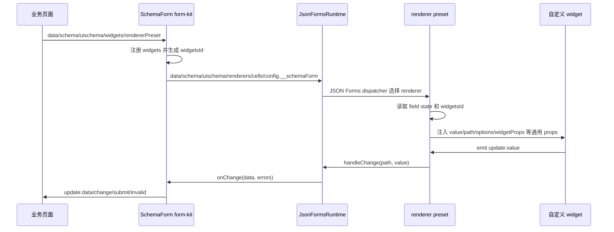

# UI 无关 Renderer Preset 与 Widget 协议解耦设计

日期：2026-04-29

## 摘要

当前 `SchemaForm` 已经支持默认 Ant Design Vue 渲染器、自定义 `widgets`、`widgetProps`、字段运行时状态、effects、validators 和异步 options。业务方可以通过 `widgets + uischema.options.widget` 接入单字段自定义组件，也可以通过 `renderers/cells` 深度覆盖 JSON Forms renderer。

但当前实现仍存在一个架构隐患：`packages/form-kit` 直接依赖 `@json-form/renderer-antdv`，而 widget 注册表也位于 `packages/renderer-antdv`。这会让“业务自定义 widget 协议”和“Ant Design Vue 默认 renderer 实现”发生绑定。后续如果业务方希望使用 Element Plus、Naive UI、Arco Design 或纯业务组件库，核心包仍会隐式带有 Antdv renderer 的组织方式。

本设计目标是把业务扩展协议沉到 UI 无关层，让 `renderer-antdv` 只作为一个 renderer preset 实现存在。短期不要求立刻实现第二套组件库，但需要调整边界，确保未来新增 `renderer-element-plus` 或业务自研 renderer 时，不需要重写 widget 协议、runtime 协议和业务接入模型。

## 目标

- 让 `form-kit` 的公共 API 与 Ant Design Vue 解耦。
- 将 widget 协议、widget 注册表和 widget 类型定义移动到 UI 无关层。
- 提供 `rendererPreset` 入口，让业务方用一个对象切换整套 renderer/cell 实现。
- 保留现有 `renderers/cells` 低层入口，兼容高级用户直接传 JSON Forms registry。
- 保留现有 `widgets + uischema.options.widget + widgetProps` 的业务写法。
- 明确未来新增 `renderer-element-plus`、`renderer-naive-ui`、业务自研 renderer 的包边界。
- 保持 `runtime`、`effects`、`validators`、异步 options 与 UI 库无关。

## 非目标

- 本阶段不实现 Element Plus、Naive UI 或 Arco Design renderer。
- 本阶段不重写 JSON Forms renderer 选择机制。
- 本阶段不替换 `JSON Schema + UI Schema` 公共表单描述协议。
- 本阶段不引入全新的字段配置 DSL。
- 本阶段不把所有 Antdv 控件 props 抽象成跨 UI 库通用 props。
- 本阶段不承诺不同 UI 库的视觉与交互完全一致，只保证公共数据流和扩展协议一致。

## 当前问题

### 1. `form-kit` 直接绑定默认 Antdv renderer

当前 `SchemaForm.ts` 从 `@json-form/renderer-antdv` 直接导入：

```ts
import { antdvCells, antdvRenderers } from '@json-form/renderer-antdv'
```

这让 `form-kit` 成为“核心 API + 默认 UI 实现”的混合包。业务方即使想使用其他组件库，也需要接受核心包对 `renderer-antdv` 的依赖。

### 2. widget 注册表位于 `renderer-antdv`

当前 widget 注册、读取、注销能力由 `renderer-antdv/src/widgetRegistry.ts` 提供。`form-kit` 在运行时向该注册表写入业务 widget，`AntdvControlRenderer` 再从注册表读取。

这条链路会导致两个问题：

- widget 协议看起来属于 Antdv renderer，而不是表单核心协议。
- 未来其他 renderer 包如果要支持同一套 widget API，必须依赖或复制 `renderer-antdv` 的注册逻辑。

### 3. `renderers/cells` 入口偏底层

直接传 `renderers/cells` 能实现多 UI 库替换，但对业务方不友好。业务方更希望选择“某套 renderer preset”，而不是理解 JSON Forms registry entry、tester rank、cell renderer 等底层概念。

### 4. 默认开箱即用与核心解耦存在张力

当前 `SchemaForm` 直接内置 Antdv 默认 renderer，使用简单。但如果完全移除默认 renderer，业务方每次都要手动传 `renderers/cells`，会降低接入体验。

因此需要同时保留：

- UI 无关核心包。
- Antdv 开箱即用封装或 preset。
- 高级直接覆盖入口。

## 设计方案

### 1. 包分层调整

目标分层：

```text
packages/engine-adapter
  JSON Forms 适配层
  不依赖任何 UI 组件库
  不依赖 form-kit 业务协议

packages/form-kit
  SchemaForm 核心 API
  runtime/effects/validators/widgets 协议
  rendererPreset 类型
  不依赖 ant-design-vue
  不依赖 renderer-antdv

packages/renderer-antdv
  Ant Design Vue renderer preset
  消费 form-kit 的 UI 无关协议
  依赖 ant-design-vue

packages/form-antdv 或 apps/demo 组合层
  组合 SchemaForm + antdvPreset
  提供 Antdv 开箱即用体验
```

未来可扩展：

```text
packages/renderer-element-plus
packages/renderer-naive-ui
packages/renderer-arco
packages/renderer-company
```

这些包都只消费 `form-kit` 暴露的通用协议，不复制业务状态模型。

### 2. `rendererPreset` 公共类型

在 `form-kit` 中新增：

```ts
export type SchemaFormRendererPreset = {
  renderers: JsonFormsRendererRegistryEntry[]
  cells?: JsonFormsCellRendererRegistryEntry[]
}
```

`SchemaForm` 新增可选 prop：

```ts
rendererPreset?: SchemaFormRendererPreset
```

优先级：

1. 如果传入 `renderers`，使用 `renderers`。
2. 如果没有传 `renderers`，但传入 `rendererPreset`，使用 `rendererPreset.renderers`。
3. 如果都没有传，使用当前兼容默认策略。

`cells` 同理：

1. 如果传入 `cells`，使用 `cells`。
2. 如果没有传 `cells`，但 `rendererPreset.cells` 存在，使用 `rendererPreset.cells`。
3. 如果都没有传，使用当前兼容默认策略。

### 3. 默认 renderer 兼容策略

为了避免破坏现有 demo 和业务接入，本阶段不立即删除 Antdv 默认能力，而是采用两阶段迁移。

第一阶段：

- `SchemaForm` 继续保持现有默认 Antdv 行为。
- 新增 `rendererPreset`。
- 标记直接内置默认 Antdv 为“兼容默认”，文档推荐新项目显式传 `antdvPreset` 或使用 `SchemaFormAntdv`。

第二阶段：

- 新增可选组合包 `@json-form/form-antdv`。
- `form-kit` 移除对 `renderer-antdv` 的直接依赖。
- 业务使用 Antdv 时从组合包导入开箱组件，或手动传 `antdvPreset`。

推荐最终使用方式：

```vue
<SchemaForm
  :data="data"
  :schema="schema"
  :uischema="uischema"
  :renderer-preset="antdvPreset"
/>
```

Antdv 开箱封装可以是：

```ts
export const SchemaFormAntdv = defineComponent({
  setup(props, context) {
    return () => h(SchemaForm, {
      ...props,
      rendererPreset: antdvPreset,
    }, context.slots)
  },
})
```

### 4. widget 协议移动到 UI 无关层

`form-kit` 保留并强化以下类型：

```ts
export type SchemaFormWidgetProps = {
  value: unknown
  path: string
  label?: string
  disabled: boolean
  required: boolean
  placeholder?: string
  description?: string
  options?: SchemaFormOption[]
  loading?: boolean
  error?: string
  schema: JsonSchema
  uischema: UISchemaElement
}

export type SchemaFormWidgetMap = Record<string, Component>
```

`defineSchemaFormWidget()` 继续作为推荐入口：

```ts
export const defineSchemaFormWidget = <TComponent extends Component>(
  component: TComponent,
) => markRaw(component) as TComponent
```

业务组件仍只依赖通用协议：

```vue
<script setup lang="ts">
defineProps<{
  value?: string
  disabled?: boolean
  placeholder?: string
}>()

const emit = defineEmits<{
  'update:value': [value: string]
  blur: []
}>()
</script>
```

组件内部可以使用任意 UI 库：

- Ant Design Vue
- Element Plus
- Naive UI
- Arco Design
- 原生 HTML
- 公司内部组件库

`form-kit` 不感知这些组件库。

### 5. widget 注册表移动到 `form-kit`

新增 `packages/form-kit/src/widgetRegistry.ts`：

```ts
export const registerSchemaFormWidgets = (
  id: string,
  widgets: SchemaFormWidgetMap,
) => {}

export const getSchemaFormWidgets = (id: string | undefined) => {}

export const unregisterSchemaFormWidgets = (id: string) => {}
```

`SchemaForm` 负责注册和注销 widget。

各 renderer 包只通过 `getSchemaFormWidgets(widgetsId)` 读取 widget，不拥有注册表。

这样未来 `renderer-element-plus` 可以直接复用同一套 widget 协议：

```ts
const registeredWidgets = getSchemaFormWidgets(schemaFormConfig?.widgetsId)
const customWidget = widget ? registeredWidgets?.[widget] : undefined
```

### 6. renderer 侧消费协议

renderer 包仍从 JSON Forms control state 中读取 `config.__schemaForm`。

建议将 renderer 消费的内部配置类型沉到 `form-kit`：

```ts
export type SchemaFormRendererConfig = {
  validation?: {
    displayMode?: ValidationDisplayMode
    submitted?: boolean
    touchedPaths?: string[]
    onFieldInput?: (path: string) => void
  }
  widgetsId?: string
  fields?: Record<string, SchemaFormFieldState>
}
```

renderer 只负责消费：

- validation display config
- widgetsId
- field state
- options/loading/optionsError
- disabled/required/visible/placeholder/description

renderer 不负责：

- 运行 fieldResolvers
- 发起 async options 请求
- 执行 effects
- 聚合 validators
- 理解 widgetProps 的业务含义

### 7. renderer preset 包导出

`renderer-antdv` 新增：

```ts
export const antdvPreset: SchemaFormRendererPreset = {
  renderers: antdvRenderers,
  cells: antdvCells,
}
```

保持现有导出兼容：

```ts
export { antdvRenderers, antdvCells }
```

未来其他 renderer 包保持同构：

```ts
export const elementPlusPreset: SchemaFormRendererPreset = {
  renderers: elementPlusRenderers,
  cells: elementPlusCells,
}
```

### 8. 业务使用方式

#### 使用 Antdv preset

```ts
import { SchemaForm } from '@json-form/form-kit'
import { antdvPreset } from '@json-form/renderer-antdv'
```

```vue
<SchemaForm
  :data="formData"
  :schema="schema"
  :uischema="uischema"
  :renderer-preset="antdvPreset"
/>
```

#### 使用其他 UI 库 preset

```ts
import { SchemaForm } from '@json-form/form-kit'
import { elementPlusPreset } from '@json-form/renderer-element-plus'
```

```vue
<SchemaForm
  :data="formData"
  :schema="schema"
  :uischema="uischema"
  :renderer-preset="elementPlusPreset"
/>
```

#### 单字段自定义 widget

```ts
const widgets = {
  userPicker: defineSchemaFormWidget(UserPicker),
}
```

```ts
{
  type: 'Control',
  label: 'User',
  scope: '#/properties/userId',
  options: {
    widget: 'userPicker',
    widgetProps: {
      multiple: false,
    },
  },
}
```

这个 `UserPicker` 可以内部使用任意组件库。只要遵守 `value/update:value/blur` 协议，就能接入同一套 `SchemaForm` 数据流。

## 数据流



## 兼容性

- 现有 `SchemaForm` 不传 `rendererPreset` 时，第一阶段继续使用当前默认 Antdv renderer。
- 现有 `renderers/cells` prop 行为不变。
- 现有 `widgets` prop 行为不变。
- 现有 `uischema.options.widget` 行为不变。
- 现有 `widgetProps` 行为不变。
- 现有 `runtime/effects/validators/fieldResolvers` 行为不变。

需要注意的兼容点：

- 移动 `widgetRegistry` 时，`renderer-antdv` 的导入路径会变化。
- 如果外部用户直接从 `@json-form/renderer-antdv` 导入 `registerSchemaFormWidgets`，应提供临时 re-export 或迁移说明。
- 如果移除 `form-kit` 对 `renderer-antdv` 的依赖，需要新增 `form-antdv` 或在 demo 中显式传 preset，避免示例断裂。

## 实施顺序建议

### 第一阶段：非破坏性解耦

1. 在 `form-kit` 新增 `SchemaFormRendererPreset` 类型。
2. 在 `SchemaForm` 新增 `rendererPreset` prop。
3. 在 `renderer-antdv` 导出 `antdvPreset`。
4. 将 widget registry 移动到 `form-kit`。
5. `renderer-antdv` 从 `form-kit` 读取 widget registry。
6. 保持 `form-kit` 当前默认 Antdv 行为不变。
7. 更新 demo，显式传入 `antdvPreset`。
8. 更新业务接入文档，推荐使用 `rendererPreset`。

### 第二阶段：核心包完全 UI 无关

1. 新增 `@json-form/form-antdv` 组合包，导出开箱即用的 `SchemaFormAntdv`。
2. 移除 `form-kit` 对 `renderer-antdv` 的依赖。
3. `SchemaForm` 在没有 `rendererPreset/renderers` 时给出明确开发期提示。
4. demo 改用 `SchemaFormAntdv` 或显式传 `antdvPreset`。
5. 文档将 `form-kit` 定义为 UI 无关核心入口。

### 第三阶段：验证第二套 renderer

1. 选择一个最小目标组件库，例如 Element Plus。
2. 实现文本、数字、布尔、枚举、布局的最小 renderer preset。
3. 复用同一套 `widgets/runtime/effects/validators` demo。
4. 验证业务自定义 widget 不依赖 Antdv renderer。

## 验证策略

第一阶段最低验证：

- `npm run build`
- demo 使用 `antdvPreset` 后行为不变。
- 自定义 `moneyInput` 和 `dialogUpload` 仍能写回表单数据。
- `widgetProps` 仍能透传给自定义 widget。
- `renderers/cells` 直接传入时优先级高于 `rendererPreset`。
- 不传 `rendererPreset` 时保持当前兼容默认行为。

第二阶段最低验证：

- `form-kit` 的 `package.json` 不再依赖 `@json-form/renderer-antdv`。
- `form-kit` 构建不需要安装 `ant-design-vue`。
- `form-antdv` 或 demo 能组合 `SchemaForm + antdvPreset` 正常运行。
- 业务自定义 widget 在组合包和显式 preset 两种用法下表现一致。

## 风险与缓解

### 风险：短期 API 入口变多

引入 `rendererPreset`、保留 `renderers/cells`、再加未来 `SchemaFormAntdv`，可能让用户疑惑。

缓解：文档明确推荐顺序：

1. 普通业务使用 `SchemaFormAntdv` 或 `rendererPreset`。
2. 需要替换整套 UI 库时换 preset。
3. 需要高级覆盖时才直接传 `renderers/cells`。

### 风险：renderer 包依赖 `form-kit` 造成循环

如果 `form-kit` 继续依赖 `renderer-antdv`，同时 `renderer-antdv` 又依赖 `form-kit` 的 widget registry，就会形成包级循环。

缓解：

- 第一阶段只在类型或 registry 层小心处理导入。
- 更稳妥的长期方案是新增 `packages/form-protocol`，放置 widget 协议、renderer config 类型和 registry。
- 第二阶段移除 `form-kit -> renderer-antdv` 后，循环自然消失。

### 风险：跨 UI 库 widget 行为不一致

不同 UI 库对空值、日期、文件、选项格式的处理不同。

缓解：

- `SchemaFormWidgetProps` 只定义表单框架通用协议。
- 具体组件库 renderer 负责自身值规范化。
- 自定义 widget 写回稳定业务值，不写回 UI 库内部对象，除非业务明确需要。

### 风险：默认 Antdv 行为迁移影响现有用户

如果直接移除默认 renderer，现有使用方会出现空白或不渲染。

缓解：

- 先非破坏性新增 `rendererPreset`。
- demo 和文档先迁移到显式 preset。
- 等迁移路径稳定后，再移除核心包默认 Antdv 依赖。

## 验收标准

第一阶段完成后：

- `SchemaForm` 支持 `rendererPreset`。
- `renderer-antdv` 导出 `antdvPreset`。
- widget registry 不再由 `renderer-antdv` 独占。
- demo 显式使用 `antdvPreset`。
- 自定义 widget 的业务写法不变。
- `npm run build` 通过。

第二阶段完成后：

- `form-kit` 不直接依赖 `renderer-antdv`。
- Antdv 开箱体验由 `form-antdv` 或显式 preset 提供。
- 新增第二套 renderer 包时，不需要复制 widget 注册表和业务 runtime 协议。

## 后续建议

本设计应先按第一阶段实施，避免一次性拆包造成过大风险。第一阶段完成后，再决定是新增 `form-antdv` 组合包，还是先验证一个最小 `renderer-element-plus` preset。
